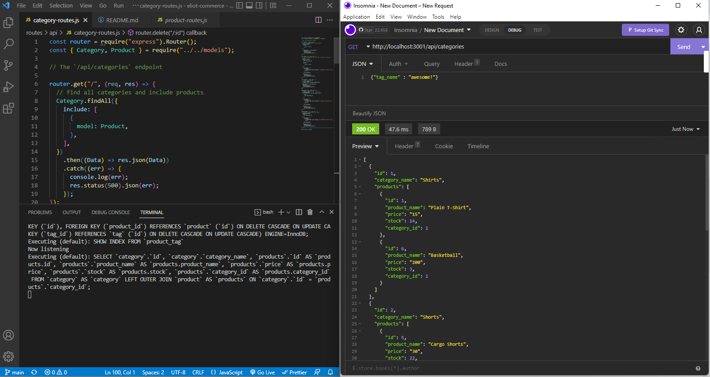

# eliot-commerce

**This is a backend only project utilizing Node, Express, Sequelize and of course MySql. The project showcases RESTful API CRUD methods via local server endpoints using the Sequelize ORM. Completeling this assignment helped solidify RESTful concepts and deepened my understanding of ORMs.**

## Table of Contents

[Installation Instructions](#installation-instructions)

[Usage Information](#usage-information)

[Contribution Guidelines](#contribution-guidelines)

[Collaboration Credits](#collaboration-credits)

[Questions](#questions)

[License](#license)

## Installation Instructions

Node and MySql must be installed. Clone or fork repo and run npm install locally. Next, create the database using mysql shell ->source db/schema.sql from the repo directory. Next, seed the database by running node seeds/index.js. Now your database is set up and ready to manipulate using insomnia or postman.
## Usage Information

Please see the [video](https://watch.screencastify.com/v/UpQ1LeQgtrF4zesAu985) for a demonstration. Enjoy!
## Contribution Guidelines

Anyone is welcome to contribute by creating an issue or feature branch. Please reach out as this repo is not closely monitored.
## Collaboration Credits

This is a homework assignment for a full stack Boot Camp where some starter code was provided.
## Questions
For information about the developer, see my [GitHub Profile](https://github.com/eclevela-1234)

For general questions, please email me: eliothead@live.com
## License
Copyright (c)  2022 by [eclevela-1234](https://github.com/eclevela-1234)

MIT License

Permission is hereby granted, free of charge, to any person obtaining a copy
of this software and associated documentation files (the "Software"), to deal
in the Software without restriction, including without limitation the rights
to use, copy, modify, merge, publish, distribute, sublicense, and/or sell
copies of the Software, and to permit persons to whom the Software is
furnished to do so, subject to the following conditions:

The above copyright notice and this permission notice shall be included in all
copies or substantial portions of the Software.

THE SOFTWARE IS PROVIDED "AS IS", WITHOUT WARRANTY OF ANY KIND, EXPRESS OR
IMPLIED, INCLUDING BUT NOT LIMITED TO THE WARRANTIES OF MERCHANTABILITY,
FITNESS FOR A PARTICULAR PURPOSE AND NONINFRINGEMENT. IN NO EVENT SHALL THE
AUTHORS OR COPYRIGHT HOLDERS BE LIABLE FOR ANY CLAIM, DAMAGES OR OTHER
LIABILITY, WHETHER IN AN ACTION OF CONTRACT, TORT OR OTHERWISE, ARISING FROM,
OUT OF OR IN CONNECTION WITH THE SOFTWARE OR THE USE OR OTHER DEALINGS IN THE
SOFTWARE.

For more information visit https://opensource.org/licenses/MIT

